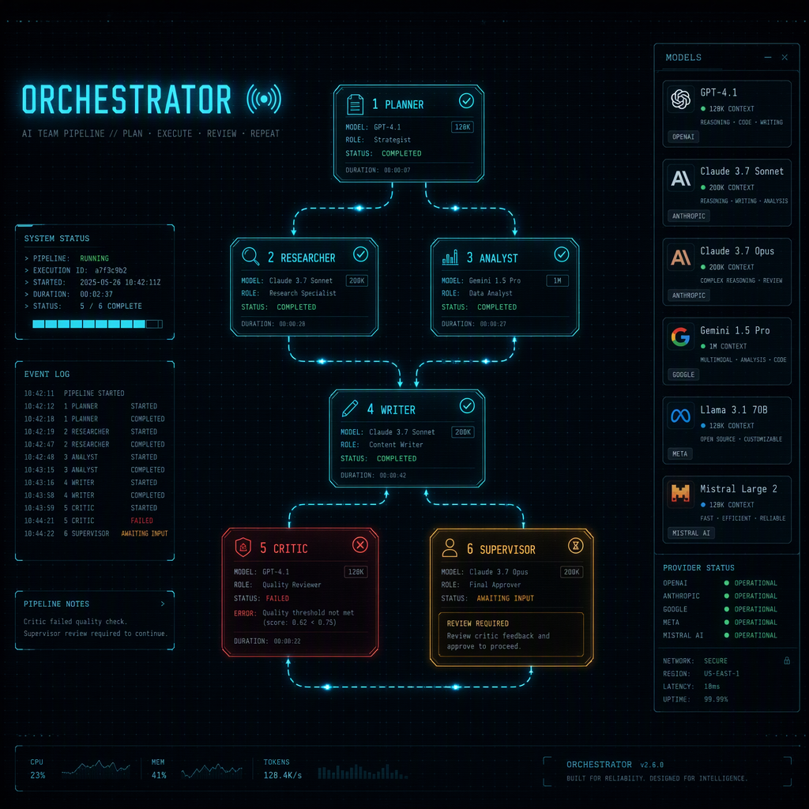
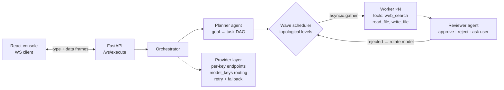

<div align="center">



# ORCHESTRATOR

**A team of AI agents that plans, executes, reviews — and you run the console.**

Give it a goal in plain English. A planner agent decomposes it into a task DAG,
concurrent workers execute each step with live tool access (web search, file
read/write), a reviewer gates every output, and you stay in the loop: approve,
steer mid-run, assign a different model to any step, or hit STOP.

*FastAPI · WebSockets · React 18 · React Flow · SQLAlchemy · Docker · GitHub Actions*

</div>

---

## What makes it different

Most "agent" demos are one chat loop with extra steps. This is an **operations
console for a small AI team** — built milestone by milestone (M1–M24), each one
verified by executed evidence, not vibes.

### Multi-model by design
- **Model Bay** — drag-and-drop chips from a catalogue merged across *all* your
  API keys. `gsk_` keys hit Groq, `sk-or-` keys hit OpenRouter, `nvapi-` keys hit
  NVIDIA — the endpoint is derived from the key, never hardcoded.
- **Per-task routing** — assign any model to any step, pre-flight or mid-review;
  each task's calls are billed to the key that serves its model.
- **Whitelist + guardrail** — the planner may only pick models your keys can
  actually serve; anything else is corrected before a wave runs.
- **Model rotation** — if a step fails (provider error or reviewer rejection),
  the *same step* repeats on the next capable model, up to 3.
- **Self-adaptation** — `max_tokens` too big for a model? Halve and retry. No
  tool calling? Degrade to plain completion. Dead key? You get a clear message,
  not a stack trace.

### Human-in-the-loop
- Planner or reviewer can **pause a task** and ask you — with the upstream
  results shown in the approval widget so you're choosing with context.
- **Review-plan gate**: hold after planning, re-assign models per node, then
  release. Or pre-assign slots before pressing ENGAGE and never pause at all.
- **STOP** button halts cleanly at the next task boundary.

### The console
Live DAG canvas with flowing signal edges, per-node status states, tool-call
badges, retry/rotation traces, an inspector drawer, a scrolling event feed, and
a final deliverable modal — all driven by one pure per-frame reducer over the
WebSocket stream. Pan, zoom, drag nodes; RECENTER rescues a drifted view.

## Architecture



Every pipeline step streams events (`planning_started`, `task_started`,
`tool_execution`, `task_model_retry`, `run_completed`, …) — the frontend is a
pure function of that stream, so the UI can never drift from reality.

## Quickstart

```bash
git clone https://github.com/hawky245/ai-team-orchestrator && cd ai-team-orchestrator

# backend
python -m venv venv
venv\Scripts\activate          # source venv/bin/activate on Linux/macOS
pip install -r requirements.txt
copy .env.example .env         # put your NVIDIA / Groq / OpenRouter key in
set PYTHONPATH=. && python -m uvicorn api:app --port 8100

# frontend (second terminal)
cd frontend && npm install && npm run dev
```

Open http://127.0.0.1:5173 — the bay loads models from your key automatically.

**Or with Docker:** `docker compose up` → dashboard on :80, backend on :8000,
SQLite persisted on a volume.

### Try this goal

> Research the three best open-source LLM inference runtimes using web search.
> Before writing anything, pause and ask me which one to feature. Then draft a
> technical comparison, write a 150-word memo for the one I choose, save it to
> memo.md, and review the saved file for accuracy.

It exercises the whole stack: concurrent research with live tool calls, the
human pause (with options surfaced), per-task model assignment, a real file
artifact, and a review grounded in reading it back from disk.

## Configuration

| Variable | Purpose |
|---|---|
| `LLM_API_KEY` | Provider key(s) — comma-separated rotates across keys |
| `LLM_MODEL_ID` | Planner/default model (key prefix picks the endpoint) |
| `LLM_BASE_URL` | Optional custom OpenAI-compatible endpoint |
| `LLM_FALLBACK_MODEL_ID` | Optional fallback when a model exhausts retries |
| `DB_PATH` | SQLite location (Docker mounts it on a volume) |

Keys from the dashboard's **Key Ring** travel in POST bodies and WS payloads —
never in URLs, never logged, never echoed back.

## Tests & CI

60 offline tests — wave scheduling, concurrency (with real event-loop timing
checks), tool loops, retry/fallback, pause/resume, plan review, multi-key
routing, whitelist/guardrail/rotation, file sandboxing, stop semantics. No API
keys or network needed; GitHub Actions runs them on every push against the same
Python the Docker image uses.

```bash
PYTHONPATH=. pytest tests/ -q
```

---

*Built as a numbered-milestone project — every feature landed with executed
evidence (offline suites or captured live runs) before its commit.*
